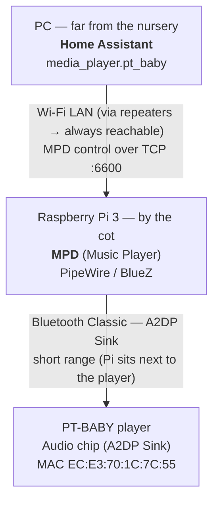

import Note from "@components/Note.astro";

## The Problem

Out of the box, playing a lullaby is a chore. I have to grab my phone, connect it to the cradle over Bluetooth, start the track - and then **leave the phone sitting next to the cot**, because the moment it wanders out of range the connection drops and the music stops. So the one device I actually want in my pocket is stuck babysitting the speaker.

What I really want is to fire off a lullaby **without** parking my phone by the crib: trigger it from anywhere - a wall tablet, a voice command, or an automation - and have it play reliably from a device that lives next to the cradle full-time. That's exactly what the setup below delivers.

## How It Fits Together (Two Devices, One Wi-Fi)

The single most important design decision is that the work is split across **two physically separated machines**, bridged by the home Wi-Fi:

- **Home Assistant runs on a PC**, not on the Pi, and that PC lives far from the nursery.
- **The Raspberry Pi 3 owns the Bluetooth radio** and sits right next to the cradle, keeping the Classic Bluetooth (A2DP) audio link short and reliable.
- The PC and the Pi never speak Bluetooth to each other - only **Wi-Fi (MPD on TCP `6600`)**. Because the house is blanketed by **Wi-Fi repeaters**, that control link is always reachable no matter how far apart they are.

In short: long-range, latency-tolerant _control_ travels over Wi-Fi; short-range, bandwidth-heavy _audio_ stays local to the Pi over Bluetooth.



## Step 1: Find the Right Bluetooth Chip

The first surprise is that the PT-BABY shows up as **two** Bluetooth devices, because it has a dual-chip design sharing one antenna:

- **The app chip (BLE):** advertises as `PT-BABY app` at `EC:E3:70:D2:50:E6`. It only handles low-energy control data for the phone app - no audio.
- **The audio chip (Classic BT):** advertises as `PT-BABY` at `EC:E3:70:1C:7C:55`. This is the actual wireless speaker (A2DP sink) - the one we care about.

We bypass the app chip entirely and target the audio MAC for everything that follows.

<Note type="HELPFUL">

**Your MAC addresses will differ.** Run `bluetoothctl scan on` for a few seconds and watch for the two `PT-BABY` entries. The one **without** `app` in the name is your audio chip - note its address, you'll reuse it everywhere below.

</Note>

## Step 2: Pair Directly by MAC

Auto-scan is unreliable on this chip, so skip discovery entirely. Since we already know the audio MAC, pair and trust it directly:

```bash
bluetoothctl
[bluetoothctl]> power on
[bluetoothctl]> agent on
[bluetoothctl]> pair EC:E3:70:1C:7C:55
[bluetoothctl]> trust EC:E3:70:1C:7C:55
```

`trust` is the part that matters for a headless setup - it lets the Pi re-establish the link later without anyone confirming a prompt.

## Step 3: Run MPD in User-Space, Next to PipeWire

Modern Raspberry Pi OS uses **PipeWire** as its audio engine, and PipeWire isolates Bluetooth audio to the **logged-in user** (`pi`). A system-wide MPD daemon runs as its own user and can't see that session's Bluetooth sink - so instead of fighting permissions, we run MPD as the same user.

First, disable the system-wide instance so the two don't collide:

```bash
sudo systemctl disable --now mpd.service mpd.socket
```

Then create a user-level config at `~/.config/mpd/mpd.conf`:

```text
# Bind to all interfaces so the PC's Home Assistant can reach us over Wi-Fi
bind_to_address "0.0.0.0"
port            "6600"

# Hand audio straight to PipeWire, which owns the Bluetooth sink
audio_output {
    type   "pipewire"
    name   "PT-BABY Bluetooth"
}
```

Because MPD now runs inside the `pi` session alongside PipeWire, it picks up the Bluetooth output (`bluez_output.EC_E3_70_1C_7C_55.1`) automatically - no socket forwarding, no access-control workarounds.

<Note type="HELPFUL">

**Why `0.0.0.0`?** MPD defaults to localhost only. Binding to all interfaces is what lets the Home Assistant PC reach the Pi across the Wi-Fi network on port `6600`. On a trusted home LAN that's fine; don't expose port `6600` to the internet.

</Note>

## Step 4: Keep the Connection Alive

Bluetooth speakers drop the link aggressively when idle to save power. So the moment Home Assistant tries to play something, the cradle is usually asleep and the audio fails.

The fix is a small script that forces a reconnect if the device isn't already connected. Save it as `/usr/local/bin/connect_baby.sh`:

```bash
#!/bin/bash
MAC="EC:E3:70:1C:7C:55"
if ! bluetoothctl info "$MAC" | grep -q "Connected: yes"; then
    bluetoothctl connect "$MAC"
    sleep 2
fi
```

Make it executable, then hook it into MPD with a systemd drop-in so it runs **before** MPD opens the audio track. Create `~/.config/systemd/user/mpd.service.d/override.conf`:

```ini
[Service]
ExecStartPre=/usr/local/bin/connect_baby.sh
```

Now every time MPD starts playback, Linux wakes and stabilises the Bluetooth pipe first - so the cradle never misses the opening notes.

## Step 5: Add It to Home Assistant

Home Assistant dropped YAML config for MPD, so this is all done through the UI - on the **PC**, pointing across the network at the Pi:

1. Go to **Settings → Devices & Services → Add Integration**.
2. Choose **Music Player Daemon (MPD)**.
3. Set **Host** to the Pi's IP address and **Port** to `6600`.

That gives you a `media_player.pt_baby` entity. From there it's a normal media player, ready for automations - for example: _if the crib sensor detects crying for more than 60 seconds between 8 PM and 4 AM, wake the speaker, confirm the connection, and play a soft lullaby._

<Note type="IMPORTANT">

The Pi must be reachable from the PC for this to work. Thanks to the Wi-Fi repeaters covering the house, the Home Assistant ↔ Pi link stays up even though the two devices sit far apart - that reliability is the whole reason the heavy Bluetooth work is delegated to the Pi instead of attempted from the PC.

</Note>

## Wrapping Up

The pattern here is worth keeping in your back pocket for any stubborn Bluetooth gadget: put a cheap Linux box next to the device to own the short, finicky radio link, expose it on the network with MPD, and let Home Assistant drive it from wherever it happens to live. A "dumb" baby cradle becomes just another speaker in the smart home - and the only copy of the magic lives in a folder of lullaby files you control.
