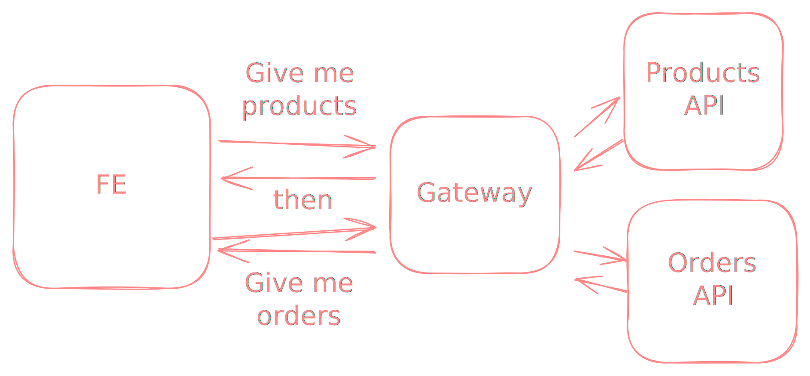
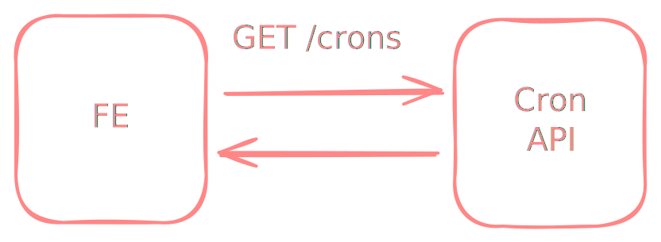
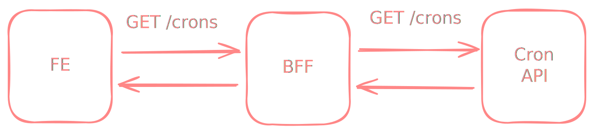

import { Demo } from "@components/Demo";
import { Note } from "@components/Note";

## Introduction

In a tipical development, the frontend application consumes data from a backend API.
The backend API is designed to be generic and serve multiple clients which can lead to
a situation where the frontend application needs to make multiple requests to the backend API to get all the data it needs.
This can lead to performance issues and a poor user experience.
Aditionaly, the data returned by the backend API may contain more data than the frontend application needs
or data that is not in the format that the frontend application expects.



<Note type="HELPFUL">
  In the image above, the frontend application needs to make multiple requests to the backend API to get all the data it
  needs.
</Note>

## Backend For Frontend

To solve these issues, you can create a dedicated backend which is optimized for
the specific needs of the frontend application.
This dedicated backend is called Backend For Frontend (BFF).
In this backend you can extend the API with new properties, reduce the amount of data
or join data from multiple sources to reduce the number of requests from the frontend application.

## Example

Let's say you want to add to a frontend application a list that displays cron jobs.
The backend API is already created and returns a list of cron jobs with the following properties:

```json
[
  {
    "id": 1,
    "name": "Backup",
    "status": "running",
    "cronExpression": "0 0 * * *"
  },
  {
    "id": 2,
    "name": "Cleanup",
    "status": "stopped",
    "cronExpression": "0 1 * * *"
  }
]
```

But bussiness requirements says that the frontend application should also display the next execution
time of each cron job and a human readable description of the cron schedule.

### Without BFF

The frontend application needs resolve a next execution time and a human readable description of the cron schedule by itself.
Parsing cron expression is not a trivial task and moreover the description should be translated to a user language.
At the end you will end with a library to parse cron expressions and another library to translate cron expression to the human readable form.
This will increase the bundle size and the complexity of the frontend application.

- [cron-parser](https://bundlephobia.com/package/cron-parser@4.9.0) - 26.3kB (Minified + Gzipped)
- [cronstrue](https://bundlephobia.com/package/cronstrue@2.50.0) - 5.6kB (Minified + Gzipped)

```javascript
import cronParser from "cron-parser";
import cronstrue from "cronstrue";

// somewhere in the frontend application
function getCronDetails(cronExpression) {
  const nextExecutionTime = cronParser.parseExpression(cronExpression).next().toString();
  const humanReadableCronExpression = cronstrue.toString(cronExpression);

  return { nextExecutionTime, humanReadableCronExpression };
}
```



### With BFF

With BFF you can extend the API with the next execution time and the human readable name of the cron expression
and return excatly what the frontend application needs.
Of course you still need to handle calculations and translations but at least you can do it in the backend
without increasing the bundle size and the complexity of the frontend application.



```js
import express from "express";
import cronParser from "cron-parser";
import cronstrue from "cronstrue";

const app = express();

// BFF logic
app.get("/crons", async (req, res) => {
  const cronList = await fetch("https://cron-api.example.com/crons");

  const cronJobsWithExtraProperties = cronList.map((cronJob) => {
    const interval = cronParser.parseExpression(cronJob.cronExpression);
    const nextExecutionTime = interval.next().toString();
    const humanReadableCronExpression = cronstrue.toString(cronJob.cronExpression);

    return {
      ...cronJob,
      nextExecutionTime,
      humanReadableCronExpression,
    };
  });

  res.json(cronJobsWithExtraProperties);
});
```

## Pros

- Optimize the API for the specific needs of the frontend application.
- Reduce the amount of data returned by the backend API.
- Join data from multiple sources to reduce the number of requests from the frontend application.

## Cons

- Increase the number of services in the architecture.
- Increase the complexity of the architecture.
- Increase the maintenance cost.

## Q&A

### Which language should I use to create a BFF?

You can use any language that you are comfortable with but
if I would recommend using the same language as the FE application.
Thanks to that you can share the code (and libraries!) between the FE and BFF.

### Should I create a separate repository for the BFF?

Not really. Having a mono-repo with the FE and BFF can simplify the development process.
When you need to make changes in the FE and BFF at the same time you can do it in a single pull request
(it is especially useful when you need to break a contract between the FE and BFF).
It is also easier to keep the versions of the FE and BFF in sync.

### About about GraphQL?

GraphQL is a great **alternative** to BFF.
In most
With GraphQL you can create a single endpoint that can be used by multiple clients.
The client can request only the data it needs and in the format it expects.
The downside of GraphQL is that it requires more effort to set up and maintain.
