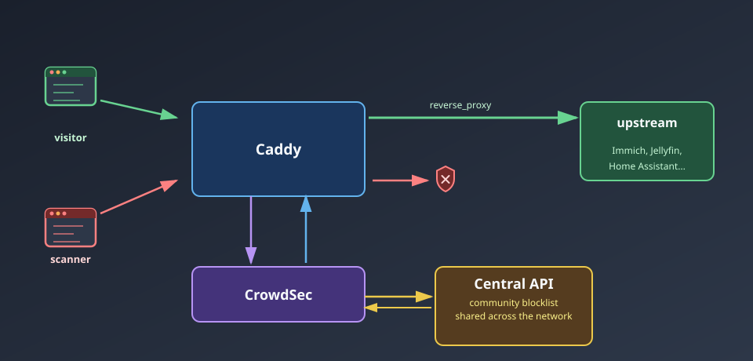

import Note from "@components/Note.astro";

## The problem

[Exposing a home lab to the internet](/blog/hL3vps) means Caddy's access log fills up with more than just real visitors. The moment `yourdomain.com` resolves to a public IP, it gets found by mass scanners within hours - probes for `/wp-login.php`, `.env` files, `.git/config`, Log4Shell headers, ThinkPHP and Jira RCE paths, all automated and constant, whether or not anything at that domain runs PHP, Java, or a CMS at all.

Caddy's own `reverse_proxy` doesn't care about any of this - it forwards a request to the upstream service exactly as well whether it's a browser or a scanner. Logging the noise (see the [monitoring setup](/blog/Nf6qLp)) tells you it's happening; it doesn't stop it.

[CrowdSec](https://www.crowdsec.net/) closes that gap: it reads the same access log, recognizes attack patterns, and hands Caddy a list of IPs to reject - before they ever reach Immich, Jellyfin, or anything else behind it.



## What CrowdSec actually is

CrowdSec is an open-source IPS modeled on fail2ban but built for structured log parsing instead of regex-on-syslog:

- **Parsers** turn a raw log line (Caddy's JSON access log, in this case) into structured events.
- **Scenarios** describe an attack pattern over those events - e.g. "N distinct sensitive-file requests from the same IP within Y minutes" - and fire an alert when matched.
- **Decisions** are the enforcement output of a triggered scenario - almost always "ban this IP for N hours."
- **Bouncers** are the components that actually enforce decisions somewhere - the Caddy plugin used here, but also nginx, iptables, and others.

The part that makes it more than a local fail2ban clone is CAPI - CrowdSec's Central API. Every participating instance can opt in to share anonymized attack signals (attacking IP, scenario matched, no request bodies or personal data), and in exchange pulls down a community blocklist of IPs every other participant has already flagged. In practice this means most mass scanners get banned on first contact, since someone else on the network has already seen and reported them.

<Note type="HELPFUL">
  This is the same trust trade-off as Cloudflare, just inverted: nothing here decrypts or proxies your traffic through a
  third party, only attack *metadata* (IP, matched rule, timestamp) is shared outbound. Sharing can be disabled entirely
  and CrowdSec still works using local scenarios only - the enrolled network effect is what turns "ban after it happens
  to you" into "ban because it happened to someone else first."
</Note>

## The setup

### 1. A custom Caddy build

CrowdSec's Caddy integration ships as an unofficial plugin, so stock Caddy doesn't have it - it needs building in with [xcaddy](https://github.com/caddyserver/xcaddy):

```dockerfile
FROM caddy:2.11.2-builder AS builder

RUN xcaddy build \
    --with github.com/mholt/caddy-l4 \
    --with github.com/caddyserver/transform-encoder \
    --with github.com/hslatman/caddy-crowdsec-bouncer/http@main \
    --with github.com/hslatman/caddy-crowdsec-bouncer/layer4@main

FROM caddy:2.11.2

COPY --from=builder /usr/bin/caddy /usr/bin/caddy
```

Two variants of the plugin get built in: `http` for the reverse proxy directive used here, and `layer4` for bouncing at the TCP/UDP level via `caddy-l4` (not used in this setup, but no extra cost to include).

### 2. CrowdSec next to Caddy

```yaml
services:
  caddy:
    build:
      context: .
      target: caddy
    ports:
      - "80:80"
      - "443:443"
    volumes:
      - ./caddy/conf:/etc/caddy
      - ./caddy/logs:/var/log/caddy
    depends_on:
      - crowdsec
    networks:
      - reverse-proxy
      - crowdsec
    env_file:
      - .env

  crowdsec:
    image: crowdsecurity/crowdsec:v1.7.8
    environment:
      - COLLECTIONS=crowdsecurity/caddy crowdsecurity/base-http-scenarios crowdsecurity/http-cve
      - BOUNCER_KEY_CADDY=${CROWDSEC_API_KEY}
    volumes:
      - ./crowdsec/config:/etc/crowdsec
      - ./crowdsec/data:/var/lib/crowdsec/data
      - ./caddy/logs:/var/log/caddy:ro
    networks:
      - crowdsec

networks:
  reverse-proxy:
    name: reverse-proxy
  crowdsec:
    driver: bridge
```

`COLLECTIONS` is the important line - it pulls in ready-made parser/scenario bundles from the CrowdSec hub instead of writing detection rules by hand: `crowdsecurity/caddy` teaches it to parse Caddy's JSON log format, `crowdsecurity/base-http-scenarios` adds generic HTTP abuse detection (probing, bad user agents, path traversal, brute force), and `crowdsecurity/http-cve` adds pattern matches for a long list of known CVE exploit attempts (Log4Shell, Spring4Shell, ThinkPHP, Jira, F5 BIG-IP, and dozens more).

CrowdSec only needs read access to `caddy/logs` - it never touches the request path directly, it just tails the same file Caddy is already writing to.

<Note type="IMPORTANT">
  `BOUNCER_KEY_CADDY` isn't invented locally - it's registered against CrowdSec's local API first, with `cscli bouncers
  add caddy-bouncer`, which prints the key to put in `.env`. Registering it any other way (or reusing a key) just gets
  that bouncer rejected on its next poll.
</Note>

### 3. Wiring the bouncer into Caddy

```
{
	order crowdsec first

  crowdsec {
    api_url http://crowdsec:8080
    api_key {$CROWDSEC_API_KEY}
  }
}

yourdomain.com, *.yourdomain.com {
	crowdsec

	@photos host photos.yourdomain.com
	handle @photos {
		reverse_proxy immich:2283
	}

	# ... other subdomains
}
```

`order crowdsec first` in the global block makes the bouncer the very first thing that runs on every request, ahead of routing or the reverse proxy itself - a banned IP gets a `403` before Caddy even decides which upstream it was asking for. The `crowdsec` line inside the site block is what actually turns the check on for that domain.

Under the hood the plugin defaults to polling CrowdSec's local API every 60 seconds and caching the decision list in memory (`stream` mode), rather than making a network call per request - a banned IP is rejected from the in-memory cache, not by querying CrowdSec live each time. That trade-off means a newly-banned IP can slip through for up to a minute after the ban is created, in exchange for zero added latency on every request.

### 4. Optional: banning a whole country

CrowdSec already resolves the origin country of every alert via GeoIP - the same `crowdsec/data` directory that ships the attack signature lists also bundles `GeoLite2-City.mmdb` and `GeoLite2-ASN.mmdb`, and an `s00-enrich` postoverflow stage attaches the resolved country code to `Alert.Source.Cn` before the alert ever reaches a profile. That makes country-based banning a `profiles.yaml` rule, not a separate integration:

```yaml
name: geofencing_profile
filters:
  - Alert.Remediation == true && Alert.GetScope() == "Ip" && Alert.Source.Cn != "PL"
decisions:
  - type: ban
    duration: 24h
on_success: break
```

Any IP-scoped alert whose GeoIP country *isn't* `PL` gets a flat 24-hour ban, regardless of which scenario actually fired. `on_success: break` stops the profile pipeline there, so this rule doesn't also fall through to whatever the default profile would otherwise have decided.

<Note type="HELPFUL">
  This is a whitelist, not a blacklist - for a home lab domain with no legitimate reason to be reached from outside its
  own country, banning everything except the one country real traffic comes from blocks a much larger slice of the noise
  in a single rule than blacklisting individual countries ever would.
</Note>

## What it actually caught

A week of exposure gives `cscli metrics` something to show. Scenarios that fired against this specific server:

| Scenario | Hits |
|---|---|
| `http-probing` | 40 |
| `http-crawl-non_statics` | 30 |
| `http-admin-interface-probing` | 28 |
| `http-wordpress-scan` | 26 |
| `http-backdoors-attempts` | 14 |
| everything else (bad user agents, sensitive-file probes, tech fingerprinting, Jira/Log4Shell/ThinkPHP/Pulse Secure CVE probes) | 40 |

None of those services are actually running here - no WordPress, no Jira, no ThinkPHP, no Pulse Secure VPN. Every hit is a scanner trying its luck against a domain it knows nothing about.

The decision counts make the CAPI network effect obvious:

| Reason                                                                       | Origin   | Action | Count  |
| ---------------------------------------------------------------------------- | -------- | ------ | ------ |
| `http:scan`                                                                  | CAPI     | ban    | 29,952 |
| `http:exploit`                                                               | CAPI     | ban    | 703    |
| `http:bruteforce`                                                            | CAPI     | ban    | 353    |
| `http:crawl`                                                                 | CAPI     | ban    | 91     |
| local scenarios (probing, wordpress-scan, backdoors, admin-interface, crawl) | crowdsec | ban    | 3 each |

Locally-detected bans are a handful - this one server simply hasn't been probed enough times yet to trigger its own thresholds for most scenarios. The other ~31,000 bans came pre-loaded from CAPI: IPs the wider CrowdSec community had already flagged for the exact same behavior elsewhere, blocked here on first contact instead of after this server got probed enough times to notice on its own.

<Note type="HELPFUL">
  Acquisition metrics tell the same story from a different angle: of ~32.7k Caddy log lines parsed, ~8k got whitelisted
  outright (the `whitelist-good-actors` collection excludes known-good crawlers like Googlebot's real IP ranges from
  ever being scored as an attacker), and ~22.6k were poured into scenario buckets for evaluation. Whitelisting matters
  as much as detection - without it, legitimate search engine indexing looks identical to a slow crawl scenario.
</Note>

## What it isn't

CrowdSec is behavior-based blocking derived from log lines, not a full WAF (Web Application Firewall - a layer that inspects individual request contents, like headers, bodies, and query strings, against rules to block malicious payloads before they reach the app) - it doesn't inspect request bodies, doesn't terminate and re-parse TLS, and won't catch a one-shot exploit that doesn't match a known scenario pattern or repeat often enough to cross a threshold. It also does nothing about raw request volume by itself; pairing it with Caddy's own `rate_limit` directive covers the case CrowdSec's threshold-based scenarios are slower to react to.

What it's good at is exactly the noise shown above: the constant, automated background scanning every public IP receives, filtered out before it reaches anything actually running behind Caddy - largely for free, by trusting reports from everyone else running the same setup.
