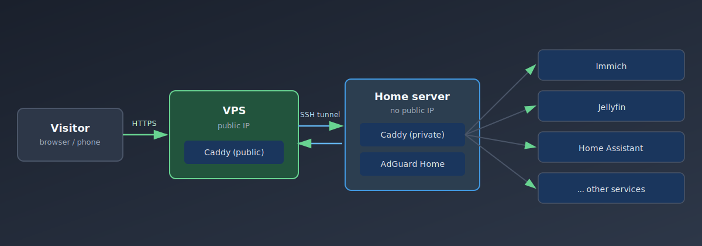
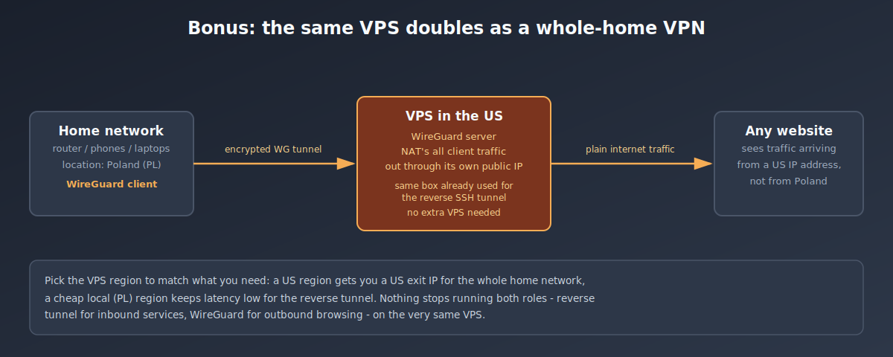

import Note from "@components/Note.astro";

## The Problem

A [home lab](/blog/yaqjpy) is great until you want to reach it from outside your own Wi-Fi - checking Immich photos on the road, sharing a Jellyfin library with family, or just hitting your Home Assistant dashboard from your phone's mobile data.

The home server sits behind a router with no public IP (or a CGNAT one your ISP won't let you forward ports on anyway), so there's nothing to point a domain at directly.

There are basically four ways to solve this:

1. **Port forwarding + dynamic DNS** - your router doesn't know where to send inbound packets unless you tell it, so you forward ports 80/443 to the home server and use a dynamic DNS service to track your changing public IP. Simplest option, but it means your home router is directly reachable from the entire internet and your real home IP is public.
2. **A static public IP from your ISP** - works, and removes the dynamic DNS problem, but it's usually not worth the price - a VPS is often cheaper (more on that below).
3. **Cloudflare Tunnel** (or similar) - free, zero-config, but every byte of your traffic is decrypted and re-encrypted by Cloudflare in the middle.
4. **A cheap VPS + reverse SSH tunnel** - a few dollars a month, no inbound ports on the home router at all, and no third party sees your plaintext traffic.

This post covers option 4 end-to-end: the actual setup running on my own home lab, plus why I ruled out the other three.



<Note type="HELPFUL">
The home server never accepts inbound connections from the internet - it dials out to the VPS and keeps that connection open. The VPS only forwards traffic back down the same tunnel it already trusts. Nobody outside can reach the home network directly: no port forwarding on the router, no CGNAT/dynamic-IP problems, and the real home IP is never revealed to a visitor or to any third-party proxy service. Compare to Cloudflare Tunnel: same trick, but the middlebox also terminates TLS and sees plaintext traffic.
</Note>

## Why not a static IP from the ISP

Some ISPs sell a static public IPv4 address as an add-on. It removes the CGNAT/dynamic-DNS problem directly, so it's tempting.

I don't recommend it, for two reasons:

- **Price.** Depending on the ISP, a static IP add-on runs anywhere from a few dollars a month to significantly more than an entire VPS costs - for strictly less functionality than the VPS gives you.
- **Safety.** With a static ISP IP, your home router is the thing directly facing the internet. Every port you open is a port an attacker can probe against your actual home network. With the VPS approach, the VPS is the thing facing the internet - it's disposable, isolated, and if it gets compromised, the attacker is still on the other side of an SSH tunnel from your home LAN, not on your LAN itself.

The only case where a static ISP IP makes sense is if you specifically need a stable IP for something that can't tolerate a middlebox at all (e.g. certain VoIP/SIP setups). For serving web apps and DNS, the VPS wins on both price and blast radius.

## Why not Cloudflare Tunnel

Cloudflare Tunnel (`cloudflared`) is genuinely easy: install an agent on the home server, it dials out to Cloudflare, Cloudflare gives you free TLS and a free subdomain, done. No VPS needed at all.

I decided against it on privacy grounds. With a tunnel, Cloudflare's edge terminates TLS - meaning **all your traffic is decrypted on Cloudflare's servers** before being re-encrypted and forwarded to your tunnel. That's a textbook man-in-the-middle position, just one you've opted into. For a public blog it's a non-issue. For photos, home automation, and personal cloud storage, I'd rather not hand a third party the plaintext of everything, however much I trust their reputation.

The VPS approach has exactly one party terminating TLS: a server I rent, configure, and fully control.

<Note type="HELPFUL">
Free domains (e.g. a `duckdns.org` or `nip.io` subdomain) pair naturally with Cloudflare Tunnel, since you don't need to point DNS at an IP you own. If you go the VPS route instead, you still need a real domain you control - see below.
</Note>

## The setup

### 1. Get a VPS

Any cheap VPS with a public IPv4 works. 1 vCPU / 512MB-1GB RAM is plenty - this whole setup is just a TLS-terminating reverse proxy and an SSH daemon, it barely uses any resources. Shop around; small European providers and the usual budget VPS players are all a few dollars a month or less.

### 2. SSH key, no password

On the home server, generate a key and copy it to the VPS:

```bash
ssh-keygen -t ed25519 -f ~/.ssh/vps_tunnel
ssh-copy-id -i ~/.ssh/vps_tunnel.pub root@YOUR_VPS_IP
```

Add a host alias in `~/.ssh/config` on the home server so the tunnel command stays simple:

```
Host vps
    Port 22
    User root
    HostName YOUR_VPS_IP
    IdentityFile ~/.ssh/vps_tunnel
```

### 3. The reverse tunnel itself

This is the actual trick, and it's just one line of `autossh`: the home server opens an outbound SSH connection to the VPS and asks the VPS to forward two of *its own* ports back down that same connection.

```
autossh -M 0 -N -o ExitOnForwardFailure=yes \
  -R 127.0.0.1:8080:127.0.0.1:80 \
  -R 127.0.0.1:2053:127.0.0.1:53 \
  vps
```

- `-R 127.0.0.1:8080:127.0.0.1:80` - anything hitting `127.0.0.1:8080` **on the VPS** gets forwarded through the tunnel to `127.0.0.1:80` **on the home server** (the local Caddy instance).
- `-R 127.0.0.1:2053:127.0.0.1:53` - same idea for DNS: VPS port 2053 forwards to the home server's port 53 (AdGuard Home).

<Note type="HELPFUL">
Binding to `127.0.0.1` on the VPS side means these forwarded ports are **not** reachable directly from the internet - only from something else running locally on the VPS (Caddy, in the next step).
</Note>

<Note type="HELPFUL">
The second forward (port 53/2053) is only needed if you run AdGuard Home (or similar) and want to reach your own private, ad-blocking DNS resolver from outside your home network too. If you're happy using your ISP's or a public DNS resolver while away from home, skip it - the setup below works for HTTP(S) alone.
</Note>

Wrapped in a systemd unit so it survives reboots and reconnects on failure:

```ini
# /etc/systemd/system/ssh-vps-forward.service
[Unit]
Description=Persistent SSH Connection to VPS
After=network-online.target

[Service]
User=youruser
# wait for the local web server and DNS server to actually be up
# before dialing out, otherwise autossh forwards to nothing
ExecStartPre=/usr/bin/bash -c 'until ss -ltn sport = :80; do sleep 2; done'
ExecStartPre=/usr/bin/bash -c 'until ss -lun sport = :53; do sleep 2; done'
ExecStart=/usr/bin/autossh -M 0 -N -o ExitOnForwardFailure=yes \
  -R 127.0.0.1:8080:127.0.0.1:80 \
  -R 127.0.0.1:2053:127.0.0.1:53 \
  vps
Restart=always
RestartSec=5

[Install]
WantedBy=multi-user.target
```

```bash
sudo systemctl daemon-reload
sudo systemctl enable --now ssh-vps-forward.service
```

<Note type="IMPORTANT">
The `ExecStartPre` checks matter more than they look. If Caddy or AdGuard Home restarts (updates, reboot, crash) after autossh has already connected, the tunnel keeps running but forwards into a dead port until autossh itself is restarted. Building in an explicit dependency, or at minimum ordering the tunnel's `After=` on the containers, saves a confusing "site down but tunnel looks fine" debugging session.
</Note>

### 4. Caddy on the VPS

The VPS needs something listening on 80/443 to grab a real TLS certificate and forward decrypted traffic into the tunnel. A stock Caddy build does the HTTP(S) part; getting DNS-over-TLS through the same box needs the `caddy-l4` plugin, so this is a small custom build:

```dockerfile
FROM caddy:2.11.2-builder AS builder
RUN xcaddy build \
    --with github.com/mholt/caddy-l4

FROM caddy:2.11.2
COPY --from=builder /usr/bin/caddy /usr/bin/caddy
```

And the `Caddyfile` on the VPS:

```
{
    layer4 {
        :853 {
            @dot tls sni dns.yourdomain.com
            route @dot {
                tls {
                    connection_policy {
                        alpn dot
                    }
                }
                proxy tcp/127.0.0.1:2053
            }
        }
    }
}

yourdomain.com, *.yourdomain.com {
    reverse_proxy 127.0.0.1:8080
}
```

That's it on the VPS side: automatic HTTPS certs for the domain and every subdomain, all forwarded down the tunnel to port 8080, which autossh is already piping to the home server's port 80. Port 853 does the same for DNS-over-TLS, using Caddy's layer4 module to inspect the TLS SNI and route it to the forwarded DNS port instead.

### 5. Caddy on the home server

The VPS doesn't know or care what's running at home - it just blindly forwards to port 80. The actual routing by subdomain happens on the home server's own Caddy instance, which was probably already running there for local `.home.arpa` domains.

So the full chain for one request looks like: **Caddy on the VPS (public, terminates TLS)** → SSH tunnel → **Caddy on the home server (private, per-subdomain routing)** → **the actual service** (Immich, Jellyfin, Home Assistant, ...). The VPS only ever sees "forward everything to port 8080"; the home Caddy is the one deciding which container each subdomain actually goes to:

```
http://*.yourdomain.com, http://yourdomain.com {
    @photos host photos.yourdomain.com
    handle @photos {
        reverse_proxy immich:2283
    }

    @movies host movies.yourdomain.com
    handle @movies {
        reverse_proxy jellyfin:8096
    }

    @assistant host assistant.yourdomain.com
    handle @assistant {
        reverse_proxy host.docker.internal:8123
    }

    @dns {
        host dns.yourdomain.com
        path /dns-query*
    }
    handle @dns {
        reverse_proxy adguardhome:80
    }
}
```

<Note type="HELPFUL">
Layer for CrowdSec on the home-side Caddy if you want automated IP banning based on log patterns (bad logins, path scanning, known CVE probes). It reads Caddy's access log and can block offenders before they reach anything behind it - cheap insurance since the VPS is the one absorbing internet-wide scanner noise all day.
</Note>

### 6. The domain

You need a real domain you own - buy one from any registrar (Namecheap, Cloudflare Registrar, OVH, etc., a few dollars to ~$15/year depending on the TLD). Then just point DNS at the VPS:

```
A     yourdomain.com          -> VPS_PUBLIC_IP
A     *.yourdomain.com        -> VPS_PUBLIC_IP
```

A wildcard `A` record means every subdomain (`photos.`, `movies.`, `assistant.`, ...) resolves to the same VPS IP, and Caddy on the VPS handles routing per-hostname from there. No DNS changes needed when adding a new service - just add a new `handle` block on the home Caddy config.

## Using the same VPS as a VPN

The same VPS can also double as an exit node for your whole home network's outbound traffic, not just for exposing services inbound. Put WireGuard on it and connect your router (or individual devices) as clients - every packet leaving your home network then appears to come from the VPS's public IP and location instead.



<Note type="HELPFUL">
Pick the VPS region to match what you need: a US region gets you a US exit IP for the whole home network, a cheap local region keeps latency low for the reverse tunnel. Nothing stops running both roles - reverse tunnel for inbound services, WireGuard for outbound browsing - on the very same VPS.
</Note>

I'll cover the actual WireGuard setup in a separate post.

## Wrapping up

The net result: services running on hardware sitting under a desk, reachable at a real domain with a real TLS certificate, with the home router never opening a single inbound port. The VPS is the only thing directly exposed to internet scanners, and it only ever forwards to `127.0.0.1` sockets that are themselves fed by an outbound-only SSH connection.

Cost: a domain (~$10-15/year) plus the cheapest VPS a provider offers (often $2-5/month). Considerably cheaper than most ISPs' static-IP add-on, and with no third party sitting on your plaintext traffic in between.
