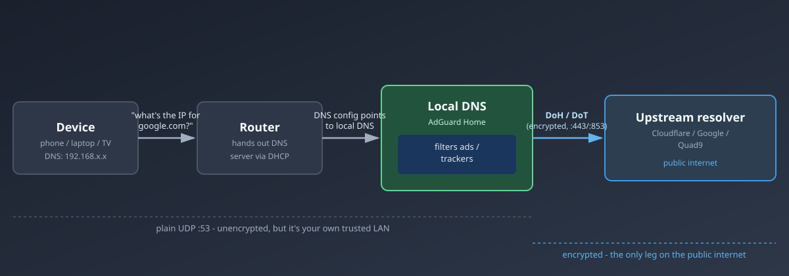

import Note from "@components/Note.astro";

## Introduction

In [Home Lab DNS & Local Domains](/blog/Wm4Tn8) we pointed AdGuard Home's upstream servers at `https://1.1.1.1/dns-query` and `https://dns.quad9.net/dns-query` and moved on - "DNS-over-HTTPS, good and private, next step." That glossed over what's actually happening on the wire, and it's worth thirty seconds of theory because it explains a few things that otherwise look like magic: why a phone's "Private DNS" setting can silently skip your AdGuard box, why some networks can't block DoH no matter how hard they try, and why the two acronyms (DoT, DoH) aren't interchangeable.

## The Problem: Plain DNS Hides Nothing

Ordinary DNS - the kind your router speaks by default - travels as **plaintext UDP on port 53**. When a device asks "what's the IP for `example.com`?", that query and its answer are readable by anyone who can see the traffic: your ISP, anyone on the same Wi-Fi, a coffee-shop router, a man-in-the-middle. Two consequences follow:

- **Privacy.** Every domain you look up is visible in transit, even if the connection that follows is HTTPS. DNS is the part of "secure browsing" that historically wasn't secure at all.
- **Tampering.** Because there's no authentication, a network in the middle can rewrite the answer - redirecting `bank.com` somewhere else, or (more mundanely) an ISP injecting ads into an NXDOMAIN response.

Encrypted DNS fixes the first problem and, as a side effect of using TLS, gets you most of the second one too (the response is coming from a server whose certificate you can verify).

<Note type="HELPFUL">

This is a different concern from **DNSSEC**, which is about _authenticating_ that an answer wasn't forged, not about hiding the query from onlookers. You can have DNSSEC without encryption, and encryption without DNSSEC. Out of scope here.

</Note>

## DNS-over-TLS (DoT)

DoT does exactly what it says: takes the same DNS protocol and wraps it in a TLS session, on its own dedicated port.

- **Port 853**, separate from everything else.
- The DNS query/response format is unchanged - just encrypted in transit.
- Because it's a dedicated port, a network operator can trivially identify and block it: firewall off 853 and DoT is dead in the water (falling back to plain port 53, if the client allows it).

That last point is DoT's defining trade-off - clean and simple, but easy to spot and easy to block.

## DNS-over-HTTPS (DoH)

DoH takes the same idea - encrypt the query - but tunnels it inside a normal HTTPS request instead of giving it its own protocol.

- **Port 443**, same as every other HTTPS website.
- A DNS query becomes an HTTP request to a URL like `https://1.1.1.1/dns-query` (that URL you set as AdGuard's upstream in the previous post).
- To a network watching traffic, a DoH lookup is indistinguishable from any other HTTPS request. There's no separate port to block, and blocking it means blocking the whole resolver's IP - which, when that IP is Cloudflare or Google, means blocking a lot of collateral traffic too.

This is also why browsers embraced DoH directly: Firefox and Chrome can ship their own hardcoded DoH resolver and quietly bypass whatever DNS the OS or router hands out, because from the network's perspective it's just another HTTPS connection to Cloudflare.

## DoT vs DoH, Side by Side

|                             | DoT                                                   | DoH                                         |
| --------------------------- | ----------------------------------------------------- | ------------------------------------------- |
| Port                        | 853 (dedicated)                                       | 443 (shared with HTTPS)                     |
| Identifiable on the wire    | Yes - distinct port                                   | No - blends with normal web traffic         |
| Easy to block at a firewall | Yes                                                   | Only by blocking the resolver's IP entirely |
| Typical user                | Network admins, routers, resolvers (AdGuard, Pi-hole) | Browsers, OS-level "Private DNS"            |
| Protocol shape              | Native DNS-over-TLS                                   | DNS wrapped in HTTP(S)                      |

Neither is "more encrypted" than the other - same TLS underneath. The difference is entirely about **what the traffic looks like to an observer**, and that's the whole reason DoH exists: to make encrypted DNS unblockable-in-practice.

## Where This Fits Into the AdGuard Setup

Worth being precise about which leg of the journey actually gets encrypted, because it's easy to assume "AdGuard does DoH" means the whole chain is encrypted end to end. It doesn't - there are two separate legs:

1. **Device → AdGuard.** Every phone, laptop, and TV on the LAN still talks to AdGuard over plain old **UDP port 53**, unencrypted. That's fine - it's your own trusted network, and AdGuard needs to see these queries in the clear anyway, since filtering domains and logging them is the entire point of running it.
2. **AdGuard → upstream.** _This_ is the leg that's actually encrypted. When AdGuard doesn't already know the answer, it forwards the query to Cloudflare or Quad9 over DoH/DoT - so what your ISP sees is one encrypted HTTPS-shaped connection from your home lab to `1.1.1.1`, not a stream of plaintext lookups for every domain your household visits.

So the mental model from the previous post holds: AdGuard is a trusted local resolver you're choosing to let see everything (that's how ad-blocking works), and DoH/DoT's job is only to protect the second half of the trip, out on the public internet.

<Note type="IMPORTANT">

**The browser bypass, explained.** In the [previous post](/blog/Wm4Tn8) we flagged that Android's "Private DNS" and some browsers quietly skip whatever DNS your router hands out. Now the mechanism is obvious: those features point straight at a DoH/DoT resolver of their own (Google, Cloudflare) instead of the DHCP-provided one, so the query never reaches AdGuard at all - no filtering, no `*.home.arpa` resolution, and it looks identical to normal HTTPS traffic, so you can't even block it at the router without blocking the resolver's whole IP range.

Fix is the same as before: turn Android's Private DNS to **Automatic**, and in Firefox disable **"Enable DNS over HTTPS"** under `Settings → Privacy & Security` (Chrome: `Settings → Privacy and security → Security → Use secure DNS` → off, or set it to "With your current service provider" so it defers to AdGuard).

</Note>

## Wrap-Up

Plain DNS is cleartext and trivially snooped or tampered with. DoT fixes that on its own dedicated port - simple, but blockable. DoH fixes the same thing while disguising itself as ordinary web traffic - unblockable in practice, which is exactly why browsers adopted it directly and why it occasionally fights with a home DNS setup instead of cooperating with it. In an AdGuard Home setup, DoH/DoT only ever protects the AdGuard-to-internet leg; the LAN-to-AdGuard leg stays plain by design, because AdGuard has to see those queries to do its job.
