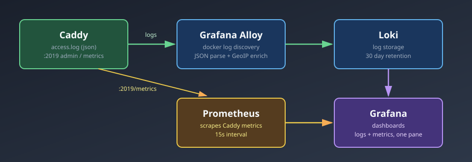
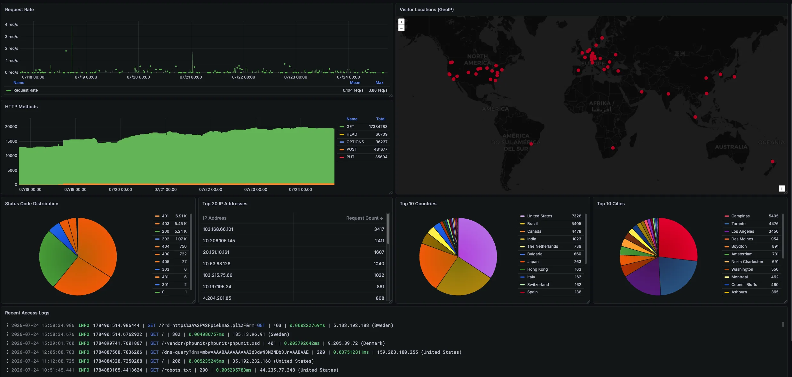
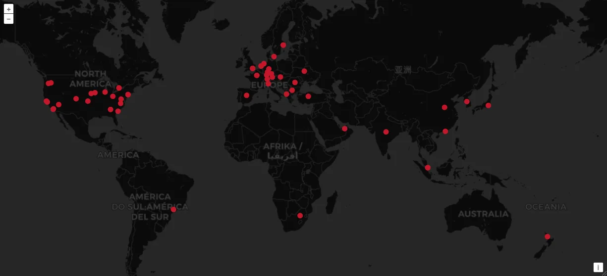

import Note from "@components/Note.astro";

## Why bother

[Exposing services to the internet](/blog/hL3vps) means anyone can now hit the home server, not just devices on the LAN. Most of that traffic is noise - scanners probing for `.env` files, bots trying default WordPress paths that don't exist here, the usual internet background radiation. Some of it isn't.

Without visibility, "someone is probing my server" and "nothing is happening" look identical from the couch. So the home lab also runs a small monitoring stack: logs and metrics from Caddy land in Grafana.



### A slice of what actually hits the server

A few hours of real Caddy access log entries, straight from Loki - the DNS-over-HTTPS probe, the WordPress/phpMyAdmin path scans, the bot that burned through eight `.php` payloads against the same IP in under four seconds:

| Time (UTC)   | Method | Path                                                     | Status | Duration (s) | Client IP       | Country              |
| ------------ | ------ | -------------------------------------------------------- | ------ | ------------ | --------------- | -------------------- |
| 15:58:34.986 | GET    | `/?rd=https%3A%2F%2Fpiekna2.pl%2F&rm=GET`                | 403    | 0.000222769  | 5.133.192.188   | Sweden               |
| 15:58:34.676 | GET    | `/`                                                      | 302    | 0.004080757  | 185.13.96.91    | Sweden               |
| 15:29:01.760 | GET    | `//vendor/phpunit/phpunit/phpunit.xsd`                   | 401    | 0.003792642  | 9.205.89.72     | Denmark              |
| 12:05:08.783 | GET    | `/dns-query?dns=mbwAAAABAAAAAAAAA3d3dwN3M2MDb3JnAAABAAE` | 200    | 0.037512811  | 159.203.180.255 | United States        |
| 11:12:08.725 | GET    | `/`                                                      | 200    | 0.005235245  | 35.192.232.168  | United States        |
| 10:51:45.441 | GET    | `/robots.txt`                                            | 200    | 0.005295783  | 44.235.77.248   | United States        |
| 10:41:43.779 | GET    | `/web/`                                                  | 200    | 0.0028883    | 136.113.9.105   | United States        |
| 10:41:43.618 | GET    | `/`                                                      | 302    | 0.003248799  | 136.113.9.105   | United States        |
| 10:34:08.178 | GET    | `/wp-content/plugins/hellopress/wp_filemanager.php`      | 302    | 0.000364974  | 20.89.100.81    | Japan                |
| 10:07:14.045 | GET    | `/.git/config`                                           | 200    | 0.003295356  | 185.93.89.147   | United Arab Emirates |
| 08:58:48.553 | GET    | `/2larp.php`                                             | 200    | 0.002589052  | 20.151.10.161   | Canada               |
| 08:58:48.181 | GET    | `/reviall.php`                                           | 200    | 0.002622059  | 20.151.10.161   | Canada               |
| 08:58:47.815 | GET    | `/wp-firewall.php`                                       | 200    | 0.002547741  | 20.151.10.161   | Canada               |
| 08:58:47.442 | GET    | `/ffffile.php`                                           | 200    | 0.002743971  | 20.151.10.161   | Canada               |
| 08:58:47.064 | GET    | `/qqqa.php`                                              | 200    | 0.001301508  | 20.151.10.161   | Canada               |
| 08:58:46.704 | GET    | `/inx.php`                                               | 200    | 0.0026738    | 20.151.10.161   | Canada               |
| 08:58:46.321 | GET    | `/file1221.php`                                          | 200    | 0.002851557  | 20.151.10.161   | Canada               |
| 08:58:45.958 | GET    | `/xhar.php`                                              | 200    | 0.000899684  | 20.151.10.161   | Canada               |
| 08:58:45.597 | GET    | `/up4.php`                                               | 200    | 0.002615861  | 20.151.10.161   | Canada               |

<Note type="IMPORTANT">
  None of the paths above lead anywhere - no WordPress, no phpMyAdmin, no `.git` folder actually exposed. Doesn't
  matter: this traffic isn't aimed at anything specific here, it's the internet-wide background scan hitting every
  IPv4 address with an open port 443/80. Put up a reverse proxy with nothing behind it and the scanners still show
  up within minutes. "I only host private stuff, nobody's coming after me" is not a reason to skip monitoring - the
  bots don't check what you're running before knocking.
</Note>

## The stack

Everything runs as docker-compose projects on the home server itself - nothing sent off to a third party:

| Component                                        | Role                                                                                    |
| ------------------------------------------------- | --------------------------------------------------------------------------------------- |
| **[Caddy](https://caddyserver.com/)**             | reverse proxy, writes structured JSON access logs, exposes admin metrics on `:2019`     |
| **[Grafana Alloy](https://grafana.com/docs/alloy/latest/)** | discovers containers, tails their logs, parses JSON, enriches with GeoIP, ships to Loki |
| **[Loki](https://grafana.com/oss/loki/)**         | stores the logs, 30 day retention                                                       |
| **[Prometheus](https://prometheus.io/)**          | scrapes metrics from itself and Caddy every 15s                                         |
| **[Grafana](https://grafana.com/oss/grafana/)**   | one pane of glass over Loki + Prometheus                                                |

## Getting logs into Loki

Caddy already writes structured JSON logs to a file and to stdout:

```
(logs) {
	log {
        output file /var/log/caddy/access.log {
            roll_size 10mb
            roll_keep 5
        }
        format json
    }

	log {
		output stdout
		format json
	}
}
```

Alloy is the piece that turns "a JSON blob in a container's stdout" into "a searchable, labeled log line in Loki". Its config is built around `discovery.docker`, which watches the Docker socket and finds the running containers, filtered down to the one named `caddy`:

```
discovery.relabel "caddy" {
  targets = discovery.docker.containers.targets

  rule {
    source_labels = ["__meta_docker_container_name"]
    regex         = "/caddy"
    action        = "keep"
  }
}

loki.source.docker "caddy" {
  host       = "unix:///var/run/docker.sock"
  targets    = discovery.relabel.caddy.output
  forward_to = [loki.process.caddy_json.receiver]
}
```

The actual parsing happens in a `loki.process` pipeline: pull fields out of the JSON, enrich the client IP with a GeoIP lookup, and turn a handful of those fields into Loki labels so they're cheap to filter and group by later:

```
loki.process "caddy_json" {
  forward_to = [loki.write.default.receiver]

  stage.json {
    expressions = {
      request_uri  = "request.uri",
      status       = "status",
      duration     = "duration",
      client_ip    = "request.client_ip",
      user_agent   = "request.headers.User-Agent[0]",
    }
  }

  stage.geoip {
    source  = "client_ip"
    db      = "/etc/geoip/GeoLite2-City.mmdb"
    db_type = "city"
  }

  stage.labels {
    values = {
      status             = "status",
      client_ip          = "client_ip",
      geoip_country_name = "geoip_country_name",
      geoip_city_name    = "geoip_city_name",
    }
  }
}
```

That `stage.geoip` block is the one that makes "who is hitting my server, and from where" an actual question you can answer instead of a column of raw IP addresses. Alloy resolves every `client_ip` against a local MaxMind GeoLite2 city database (a flat `.mmdb` file mounted read-only, no external API calls per request) and attaches country/city/lat/lon as labels.

<Note type="IMPORTANT">
  GeoIP lookups happen entirely offline against a local database file - no request data leaves the server to resolve an
  IP's location. The `.mmdb` file itself does need occasional re-downloading from MaxMind to stay accurate, since IP
  allocations shift over time.
</Note>

Authelia (the auth layer sitting in front of some subdomains) gets the same treatment through a second `loki.process` block, so failed/successful login attempts show up in Loki labeled by username and result, independent of the Caddy pipeline.

## Metrics: Prometheus

Alongside logs, Prometheus pulls numeric time series on a 15 second interval:

```yaml
scrape_configs:
  - job_name: prometheus
    static_configs:
      - targets: ["prometheus:9090"]

  - job_name: caddy
    static_configs:
      - targets: ["caddy:2019"]
```

Caddy exposes its own metrics on the admin API port (`:2019`) once `metrics { per_host }` is turned on in the global options block - request counts and latencies broken down per virtual host, so a spike on one subdomain doesn't get averaged away by traffic on the others.

Logs answer "what happened, in detail, on this one request". Metrics answer "is anything trending in the wrong direction, in aggregate". Grafana sits on top of both, so a dashboard panel showing a spike in 403s can link straight into the matching Loki query to see exactly which requests caused it.

## Grafana dashboards

This is where logs and metrics actually become useful day to day, rather than just sitting in storage.



The GeoIP labels attached back in the Alloy pipeline make a request geomap possible - a literal map of where traffic is actually coming from, which makes "why do I have thousands of requests from a country nobody in this household has ever been to" a visual, obvious pattern instead of something buried in a log line.



## Wrapping up

None of these pieces are doing anything exotic on their own - Alloy parsing JSON, Loki storing logs, Prometheus scraping numbers. What matters is that they all read from the same two sources (Caddy's access logs and its metrics endpoint), so a Grafana dashboard panel and a raw log line can always be cross-referenced for the same request. Exposing a home lab to the internet without this is running blind; this is the minimum to actually see what's hitting it. Blocking the obviously malicious stuff automatically is a separate concern, worth its own post.
