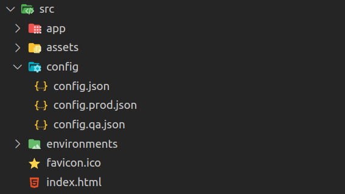

import { Note } from "@components/Note";

## Creating configuration files

In the application create a directory called config (or whatever you want) and put configuration files.



## Adding configuration files to assets

Add new position to `assets` in `angular.json` file. That means, on after building, all configurations will be added to `dist` directory.

```json
{
  // ...
  "build": {
    "builder": "@angular-devkit/build-angular:browser",
    "options": {
      // ...
      "tsConfig": "tsconfig.app.json",
      "inlineStyleLanguage": "scss",
      "assets": ["src/favicon.ico", "src/assets", "src/config"],
      "styles": ["src/styles.scss"],
      "scripts": []
    }
  }
  // ...
}
```

<Note type="CRITICAL">
  Adding `src/config` to `assets` means: copy all files to the dist directory. To copy only `config.json` you should
  write `src/config/config.json`.

```json
"assets": [
  "src/favicon.ico",
  "src/assets",
  "src/config/config.json"
],
```

</Note>

## Creating configuration token

`InjectionToken` is a special type of token that is used when you need to provide a non-class dependency (for example a interface).

```ts
export interface AppConfig {
  apiUrl!: string;
  auth!: {
    type: string;
    token: string;
  };
}

export const APP_CONFIG = new InjectionToken<AppConfig>('App configuration');
```

<Note type="HELPFUL">

The interface should be equal to the JSON schema of the configuration file.
If you can, you can try directly import JSON file as a type thanks to `TypeScript`.
More you can read on [TypeScript documentation](https://www.typescriptlang.org/docs/handbook/release-notes/typescript-5-3.html).

</Note>

## Loading configuration before bootstrap application

Fill created service with the downloaded configuration.
To do it, open `main.ts` and add `fetch` method to provide configuration as the provider.

```ts
fetch("config/config.json")
  .then((response) => response.json())
  .then((config) =>
    platformBrowserDynamic([
      {
        provide: APP_CONFIG,
        useValue: config,
      },
    ]).bootstrapModule(AppModule),
  )
  .catch((err) => console.error(err));
```

<Note type="HELPFUL">
  As is evident, `config.json` is downloaded and provided to the whole platform. Thanks to that, you can use
  `ConfigService` whenever you want.
</Note>

<Note type="CRITICAL">

If a browser does not support `fetch` method, you should use `XMLHttpRequest`.

</Note>

## Example of usage ConfigService

```ts
@Component({
  /* ... */
})
export class AppComponent {
  private appConfig = inject(APP_CONFIG);
  token = this.configService.auth.token;
}
```

## Changing configuration file

Before deploying the application you need to replace configuration files. The script should be something like that:

```bash
#!/bin/bash
env="prod" # get env from command line
mv dist/app_name/config/config.${env}.json dist/app_name/config/config.json
```
