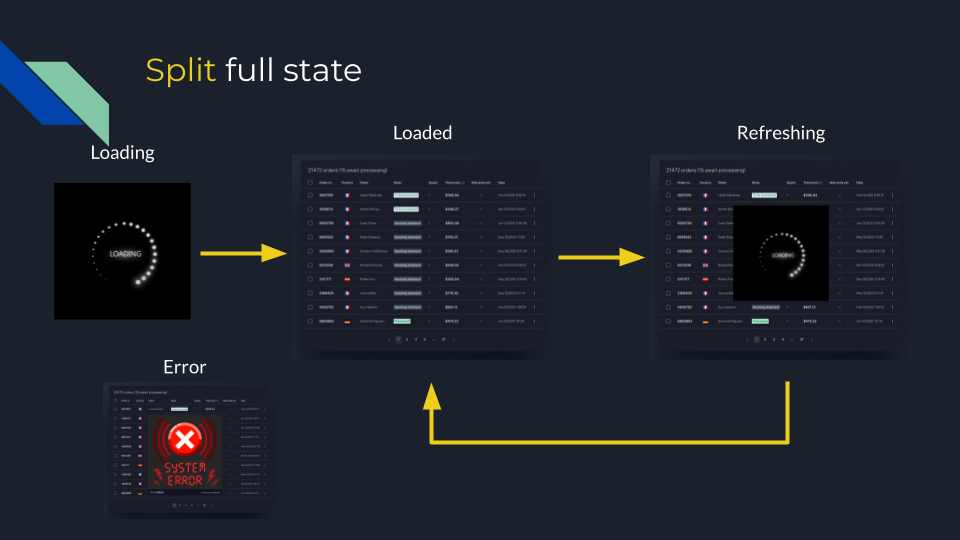

import { Note } from "@components/Note";

## Loading state

Imagine a situation where you have to send a request to a server to get data.
This operation can take some time so it can be a good idea
to display a spinner with some text to inform a user that
something is happening (instead of displaying a blank page).
To do this we can create a variable `loading` and write in our
template logic to display one of two views: _loading view_ or _data view_.

```ts
@if (loading === false) {
  <table>...</table>;
} @else {
  <p>Spinner</p>;
}
```

## More states

In a real scenario, we have more than just two states.
When we display some data we want to allow users to filter, sort or paginate it.
In this case, it would be nice to display some kind of spinner when data are updating.
But what about errors? A server can also respond with a temporary issue
(no connection to the database, internal server error, or timeout).
It also would be nice to display.

Similar to before, we can do this by adding new variables to our view: `error` and `refreshing`.
But this does not cover all needs.
We also want to store data about the error and also items to display.
This makes our component bigger and less readable.

```ts
@Component({
  template: `
    @if (loading === false) {
      <table>
        ...
      </table>
      @if (refreshing === true) {
        <p>Inner spinner</p>
      }
    } @else {
      <p>Spinner</p>
    }
    @if (error === true) {
      <p>Something bad happened</p>
    }
  `,
})
export class DataToDisplay implements OnInit {
  private service = inject(SomeService);
  loading = true;
  refreshing = false;
  error = false;

  ngOnInit() {
    this.service.get().subscribe({
      next: () => (this.loading = false),
      error: () => (this.error = true),
    });
  }

  refresh() {
    this.refreshing = true;
    this.service.get().subscribe({
      next: () => (this.refreshing = false),
      error: () => (this.error = true),
    });
  }
}
```

## State object

To resolve described problems with too many
variables we can create something that is called state object.
This pattern is about creating a plan JavaScript
object and storing all data needed to display the view in a single object.

```ts
export interface ComponentState {
  loading: boolean;
  refreshing: boolean;
  tableData: Item[] | null;
  error: boolean;
  errorData: { type: string } | null;
}

const INITIAL_STATE: ComponentState = {
  loading: true,
  refreshing: false,
  tableData: null,
  error: false,
  errorData: null,
} as const;
```

Now we can come back to our component
and replace all properties with single-state objects.
Thanks to that our component is more readable.

```ts
export class DataToDisplay implements OnInit {
  private service = inject(SomeService);
  state = getInitialState();

  ngOnInit() {
    this.service.get().subscribe({
      next: (data) => {
        this.state.loading = false;
        this.state.tableData = data;
      },
      error: (error) => {
        this.state.error = true;
        this.state.errorData = error;
      },
    });
  }
}
```

<Note type='IMPORTANT'>

In this example we mutate a state object to change a property
but if we need we can make our object read-only to
force a developer to create a new state each time we want to change something.

```ts
export interface ComponentState {
  readonly loading: boolean;
  readonly refreshing: boolean;
  // ...
}
```

</Note>

## Problem with types

Imagine a situation where we want to create an effect to measure the error count on our page.
When an error occurs we want to get the type from the `errorData` property.
We should not have a situation where `error` is set as `true` but `errorData` is `null`.

```ts
export function errorCountEffect(state: ComponentState): void {
  if (state.error === true) {
    const type = state.errorData.type; // but errorData can be null!

    ++errorCounter[type];
    // ...
  }
}
```

<Note type='IMPORTANT'>

We can add checking if `errorData` is defined but that means additional,
redundant checks because when `error` is `true` then `errorData` should always be set.

</Note>

<Note type='CRITICAL'>

_TypeScript_ will throw an error _errorData is possibly null_ only when you have `strictNullChecks` or `strict` flag turned on.

</Note>

## Union states

In a situation where we know that `error` and `errorData` properties are connected
(when `error` is `false` then `errorData` is `null` and when `error` is `true` then `errorData` is defined)
we can create interfaces for each state and connect them with [Union types](https://www.typescriptlang.org/docs/handbook/2/everyday-types.html#union-types).

```ts
export interface NoErrorState {
  loading: boolean;
  refreshing: boolean;
  tableData: Item[] | null;
  error: false;
  errorData: null;
}

export interface ErrorState {
  loading: boolean;
  refreshing: boolean;
  tableData: Item[] | null;
  error: true;
  errorData: { type: string };
}

export type ComponentState = NoErrorState | ErrorState;
```

Thanks to that separation, we tell TypeScript that `ComponentState`
is one of two states: `NoErrorState` or `ErrorState`
and TypeScript will know when `error` is `true` then `errorData` is defined.

```ts
export function errorCountEffect(state: ComponentState): void {
  if (state.error === true) {
    const type = state.errorData.type; // there is no error now!
    ++errorCounter[type];
    // ...
  }
}
```

<Note type='IMPORTANT'>

TypeScript knows that when `error` is `true` then `state` inside `if` block has type `ErrorState`.

</Note>

## Split into more states

When we know that we can create many states and connect
them into a single type we can define all possible states with interfaces.



```ts
interface LoadingState {
  loading: true;
}

interface LoadedState {
  data: Item[];
}

interface RefreshingState {
  refreshing: true;
  data: Item[];
}

interface ErrorState {
  error: true;
  errorData: { type: string };
}

export type ComponentState = LoadingState | LoadedState | RefreshingState | ErrorState;
```

## Checking current state

Imagine another situation where we want to check which state we are now.
To do this we have to check which properties are defined and which are not.
This operation is not readable and each time we have to know what to check.

```ts
function refreshState(currentState: ComponentState): RefreshingState {
  if ("data" in currentState) {
    return {
      refreshing: true,
      data: currentState.data,
    };
  }

  throw new Error("Current state is not loaded. You cannot refresh current state");
}
```

<Note type='IMPORTANT'>

Keyword `in` is used as a type guard.
Because only `LoadedState` has `data` property _TypeScript_
knows that inside `if` variable `currentState` have to be `LoadedState`.

</Note>

## Named states

To make easier checking current state we can create a special property which will hold current state name.

```ts
export interface LoadingState {
  state: "loading";
}

export interface LoadedState {
  state: "loaded";
  data: ToDo[];
}

export interface RefreshingState {
  state: "refreshing";
  data: ToDo[];
}

export interface ErrorState {
  state: "error";
  error: unknown;
}

export type ComponentState = LoadingState | LoadedState | RefreshingState | ErrorState;
```

<Note type='HELPFUL'>

We can create a interface to share base properties. This is nice to have but not required.

```ts
interface State<T> {
  state: T;
}

export interface LoadedState extends State<"loaded"> {
  data: ToDo[];
}
```

</Note>

Now we can refactor the previous function and use simple checking of `state` property.

## Summary

We have moved from many variables and end with named states. Now it is time to compare how code is written when we use those two principle.
