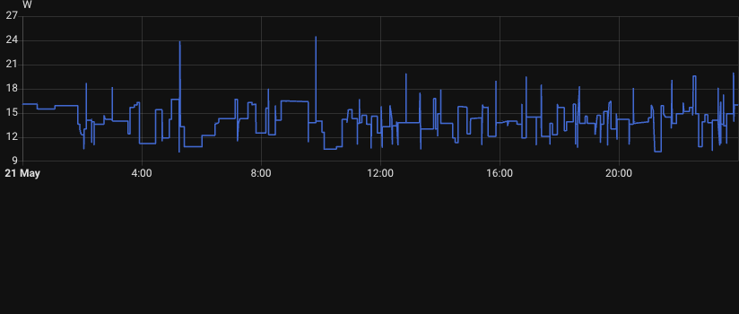

## Introduction

Building a home lab doesn't have to break the bank. Whether you're looking to learn new technologies, host your own services, or experiment with different software stacks, having a dedicated home lab server is an invaluable tool. In this guide, I'll walk you through the essential components needed to build a small, energy-efficient, and budget-friendly home lab that can handle virtualization, containerization, and various self-hosted applications.

The build I'm proposing uses modern, low-power components that provide excellent performance while keeping electricity costs down. Let's dive into each component and understand why it's the right choice for your home lab.

## Motherboard: ASUS PRIME N100I-D D4 NA mini ITX

The heart of our build is the ASUS PRIME N100I-D D4 NA, a mini ITX motherboard featuring Intel's N100 processor. This is a fantastic choice for a home lab for several reasons:

**Why This Motherboard:**

- **Integrated Intel N100 Processor**: This quad-core CPU based on Intel's Alder Lake-N architecture provides excellent performance for home lab tasks while consuming very little power (typically 6-10W under load)
- **Low Power Consumption**: Perfect for a server that runs 24/7 without significantly impacting your electricity bill
- **Compact Size**: The mini ITX form factor keeps your home lab small and manageable
- **Standard ATX Power**: Uses a standard ATX power supply, giving you flexibility in choosing power supplies

**Important Warning:**
Be careful when purchasing this motherboard! There are similar models that use an external 12V power supply instead of standard ATX power. These require special power adapters that are more expensive and harder to find. Make sure you're getting the version that accepts standard ATX power (like the one specified: PRIME N100I-D D4 NA).

**What You Can Do With It:**

- Run multiple Docker containers
- Host virtual machines with Proxmox or ESXi
- Self-host services like Nextcloud, Home Assistant, Plex, or Jellyfin
- Practice with Kubernetes clusters
- Set up network services like Pi-hole or AdGuard Home

## Storage: Goodram PX600 1TB M.2 NVMe SSD

Fast and reliable storage is crucial for any home lab. The Goodram PX600 is an excellent choice for the primary system drive:

**Why This SSD:**

- **NVMe Performance**: With read speeds up to 3500 MB/s, this drive ensures snappy system performance and fast VM/container startup times
- **1TB Capacity**: Provides ample space for your operating system, multiple VMs, containers, and applications
- **Reliability**: NVMe SSDs have no moving parts, making them perfect for 24/7 operation

**Storage Strategy:**
Since this motherboard has only one M.2 slot, it's better to start with a larger capacity drive (1TB) rather than a smaller one that you'll need to replace later. This saves you from the hassle and cost of upgrading down the line.

**Future Expansion:**
The motherboard also supports SATA drives, so you can easily add additional storage when needed. This is especially useful for:

- **Backups**: Always maintain backups of your important data
- **Media Storage**: Store large media files for Plex or Jellyfin
- **Data Archives**: Keep logs, snapshots, and archived configurations

I strongly recommend adding at least one SATA drive for backups as soon as your budget allows.

## Memory: Goodram 16GB DDR4 3200MHz CL22 SODIMM

Memory is one area where you don't want to skimp, especially if you plan to run multiple VMs or containers:

**Why 16GB:**

- **Virtualization**: 16GB provides enough headroom to run several lightweight VMs or numerous Docker containers simultaneously
- **Operating System**: Modern hypervisors like Proxmox or ESXi will use several gigabytes themselves
- **Future-Proofing**: While 8GB might work initially, you'll quickly run into limitations

**Critical Note:**
This motherboard has only ONE memory slot. This means you cannot add more RAM later - you can only replace what you have. That's why it's essential to start with 16GB right away. If you install 8GB now and need more later, you'll have to remove that 8GB module and buy a completely new 16GB (or larger) module, essentially wasting your initial purchase.

**Memory Requirements by Use Case:**

- **Docker-only setup**: 8-16GB is sufficient
- **Light virtualization**: 16GB minimum
- **Multiple VMs**: 16GB (you'll learn to manage resources efficiently)
- **Heavy workloads**: Consider a different platform with more memory slots

**Real-World Usage Example:**

To give you a concrete idea of what 16GB can handle, here's my actual setup running on similar hardware with Ubuntu Linux:

- **Operating System**: Ubuntu Server
- **Number of Docker Containers**: 25+ containers running simultaneously
- **Services Include**: Immich (photo management), Grafana (monitoring), Jellyfin (media server), and many others
- **Actual RAM Usage**: Approximately 5GB under normal load

This leaves me with over 10GB of free RAM for:

- File system caching (which significantly improves performance)
- Temporary workloads or testing new containers
- Headroom for peak usage when multiple services are heavily used
- Future expansion as I add more services

This demonstrates that 16GB provides plenty of breathing room for a comprehensive home lab, even when running dozens of containerized services. You won't feel constrained, and the system will remain responsive even during heavy use.

## Case: Akyga AK35BK PC Tower

The case might seem like a minor component, but choosing the right one makes maintenance and upgrades much easier:

**Why This Case:**

- **Adequate Size**: While theoretically you could use a smaller case, having some extra space makes cable management and component installation much easier
- **Good Airflow**: Proper ventilation ensures your components stay cool during extended operation
- **Accessibility**: Easy access to components when you need to add drives or perform maintenance
- **Mini ITX Compatible**: Perfectly sized for our mini ITX motherboard

**Space Considerations:**
If desk space is limited, remember that a home lab server doesn't need to sit on your desk. Consider:

- Under your desk
- In a closet (ensure adequate ventilation)
- On a shelf
- In a dedicated server corner

The key is finding a location with good airflow and easy access for occasional maintenance.

## Power Supply: Corsair VS450 450W 80 PLUS

A quality power supply is essential - it's not the place to cut corners:

**Why This PSU:**

- **Sufficient Wattage**: 450W is more than enough for this low-power build (the entire system will typically draw 30-50W)
- **Trusted Brand**: Corsair is a reputable manufacturer with good quality control
- **80 PLUS Certification**: Ensures good efficiency, converting more of the AC power from your wall into usable DC power

**Important Considerations:**

- **Quality Matters**: Never buy cheap, no-name power supplies. A failing PSU can damage all your other components
- **Consider Used**: Since this build has such low power requirements, a quality used power supply is a great option if you're on a budget
- **Look for 80 PLUS Gold**: If possible, aim for 80 PLUS Gold certification for better efficiency (important for a 24/7 server)
- **Modular is Nice**: A modular or semi-modular PSU makes cable management easier in the small mini ITX case

**Power Consumption:**
This entire build will consume approximately:

- **Idle**: 12-15W
- **Typical Load**: 14-18W
- **Maximum (100% CPU)**: ~25W

At typical usage, running 24/7, this will cost roughly $1-2 per month in electricity (assuming $0.12/kWh), making it very economical to operate continuously.

**Real-World Power Usage:**

My actual home lab with this setup draws approximately **14W at idle** with 25+ Docker containers running. Let's break down the real costs:

- **Power Draw**: 14W continuously
- **Monthly Consumption**: ~10 kWh per month (14W × 24 hours × 30 days = 10.08 kWh)
- **Monthly Cost**: ~$1.20/month at $0.12/kWh
- **Annual Cost**: ~$14.40/year

This is remarkably efficient! For comparison:

- A traditional desktop PC running 24/7 would cost $20-40/month
- An old server would easily cost $30-60/month
- A light bulb uses more power than this entire server

The low power consumption means you can leave your home lab running continuously without guilt or significant impact on your electricity bill. This is one of the major advantages of using modern, efficient processors like the Intel N100.

As you can see from the actual monitoring data above, the power consumption stays consistently low throughout the day, typically hovering between 12-18W with occasional spikes to around 24W during heavier workloads. This demonstrates the excellent efficiency of the Intel N100 platform in real-world usage.

## Total Cost and Assembly

**Estimated Total Cost:**

- **Motherboard with CPU**: ~$120-150
  - [Search on Amazon](https://www.amazon.com/s?k=ASUS+PRIME+N100I-D+D4+NA)
- **1TB NVMe SSD**: ~$60-80
  - [Search on Amazon](https://www.amazon.com/s?k=Goodram+PX600+1TB+M.2)
- **16GB DDR4 SODIMM**: ~$35-50
  - [Search on Amazon](https://www.amazon.com/s?k=16GB+DDR4+3200MHz+SODIMM)
- **Case**: ~$40-60
  - [Search on Amazon](https://www.amazon.com/s?k=Akyga+AK35BK+PC+Tower)
- **Power Supply**: ~$40-60 (new) or $20-30 (used)
  - [Search on Amazon](https://www.amazon.com/s?k=Corsair+VS450+450W+80+PLUS)

**Total: $295-410**

This gives you a capable home lab server that can handle a wide variety of tasks while remaining energy-efficient and quiet.

## What's Next?

Once you've assembled your home lab, you can start with:

1. **Install a Hypervisor**: Proxmox VE is free and excellent for beginners
2. **Set Up Docker**: Run containerized applications easily
3. **Configure Backups**: Use the SATA drive for automated backups
4. **Start Small**: Begin with one or two services and expand gradually
5. **Learn and Experiment**: That's what a home lab is for!

## Conclusion

Building a home lab doesn't require enterprise-grade equipment or a massive budget.
This configuration provides an excellent foundation for learning and hosting your own services.
The low power consumption means you can run it 24/7 without guilt,
and the component choices ensure you have room to grow as your needs expand.

Remember: the best home lab is the one you'll actually use. Start with this solid foundation, and expand as you discover what works for your specific needs. Happy homelabbing!
